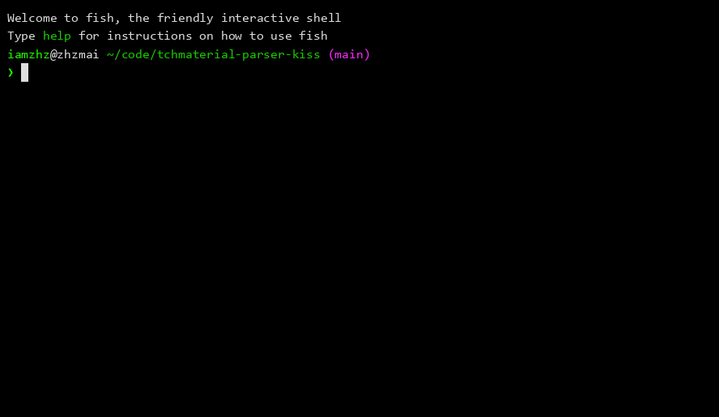
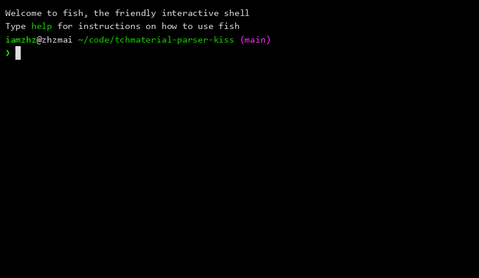

# tchmaterial-parser-kiss

本工具是 [tchMaterial-parser](https://github.com/happycola233/tchMaterial-parser) 的 fork，帮助您从[**国家中小学智慧教育平台**](https://basic.smartedu.cn/)获取电子课本等资源，本分支遵循 K.I.S.S. 原则，专注于 CLI 场景。  
本工具是 fork 自原项目的 `4e53a3b5fa12584d0d5b2189792bb5576529e3fd`。  
本工具依照开源协议保留了原项目的 MIT License，同时添加自己的开源协议(MIT)。  
  
[下载示例](https://asciinema.org/a/Dgk0lquwVT7pZ8Cf)  
[](https://asciinema.org/a/Dgk0lquwVT7pZ8Cf)  
[设置 Access Token 示例](https://asciinema.org/a/eAWiBH2gWBEP9RE7)   
[](https://asciinema.org/a/eAWiBH2gWBEP9RE7)  

## 与原项目的异同
*同*:  
**核心功能**：本分支的核心解析、下载功能依然是原项目的代码，只做了轻微的适配改动。  
*异*：  
**项目结构**：本分支 fork 自原项目项目结构改动之前的版本，可单文件使用；  
**界面**：本分支完全删除了原项目的 Tkinter 图形界面，使用命令行操作，引用 `rich` 和 `prompt_toolkit` 美化。  

## 如何选择
如果你在犹豫如何选择，请使用[原项目](https://github.com/happycola233/tchMaterial-parser)，更美观、易操作；  
如果你习惯从源码运行，并且喜欢轻量，可以尝试一下这个分支。  
**注意**：本项目的使用需要你先了解原项目的基本功能，README 中不会重复介绍这些内容。

## 快速开始
### 从源码运行
```bash
git clone https://github.com/iamzhz/tchmaterial-parser-kiss.git
cd tchmaterial-parser-kiss
pip install -r requirements.txt
python main.py
```

## License
[原项目的 MIT License](./LICENSE-original)  
[本项目的 MIT License](./LICENSE)

